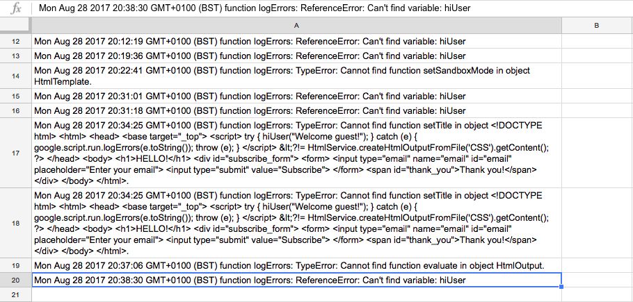

## Google Apps Script. Backend and Frontend Error logging in the spreadsheet.
### Using RPC (remote procedure call) on Frontend
`google.script.run.withSuccessHandler( frontendOnSuccessFunc() ).backendRemoteFunc()
google.script.run.withFailureHandler( frontendOnFailureFunc() ).backendRemoteFunc()`

